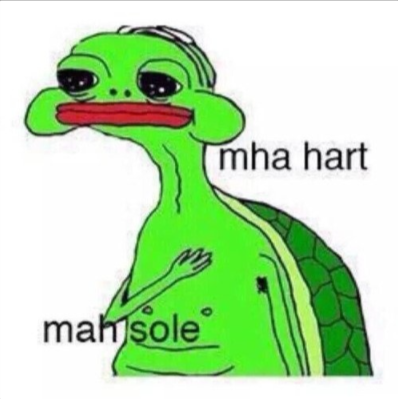
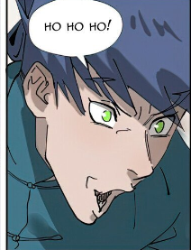

## 🌟 About Me

My field of interest are none.

```js
class Ashish {
  constructor() {
    this.name = "Ashish Jha";
    this.pronouns = "He/Him";
    this.dateOfBirth = "2005-08-25";
    this.languagesKnown = ["English", "Hindi"];
    this.programmingLanguages = ["TypeScript", "Go"];
    this.hobbies = ["Cricket", "Watching anime", "Reading manga"];
  }
}
```


## ✨ Project Showcase

- [Type_dd](https://typedd-editor.vercel.app/) - A online code editor built with Next.js, TailwindCSS, Clerk, Convex, and Piston API.
- [Horse Forward](https://wrecked-aliens.netlify.app/) - A online game time limitied built with JS, HTML5 context, and OOP concept.
- [Cloud-drive](https://cldrive.vercel.app/) - A storage available on cloud with authentication, and google doesn't have access to your stored data, used a wrapper made upon s3 to store data.
- [lua theme for my nvim config](https://github.com/ashish2508/Eezzy.nvim) - It will be a theme for my nvim config utilizng a open source template and lazy.nvim to integrate it into my own configuration and others
- [ask-the-RepoAi](https://github.com/ashish2508/ask-the-RepoAi) - A AI based tool to ask questions about your codebase, it uses Gemini's API to answer questions based on the code in the repository.

## ✨ Stuff I'm Making-nothing right now

## ✨ GitHub Stats

<table>
	<td width="40%"></td>
	<td width="60%"></td>
</table>

## 🐍 GitHub Contribution Snake:


## 👀 Thanks for visiting my profile! <4



